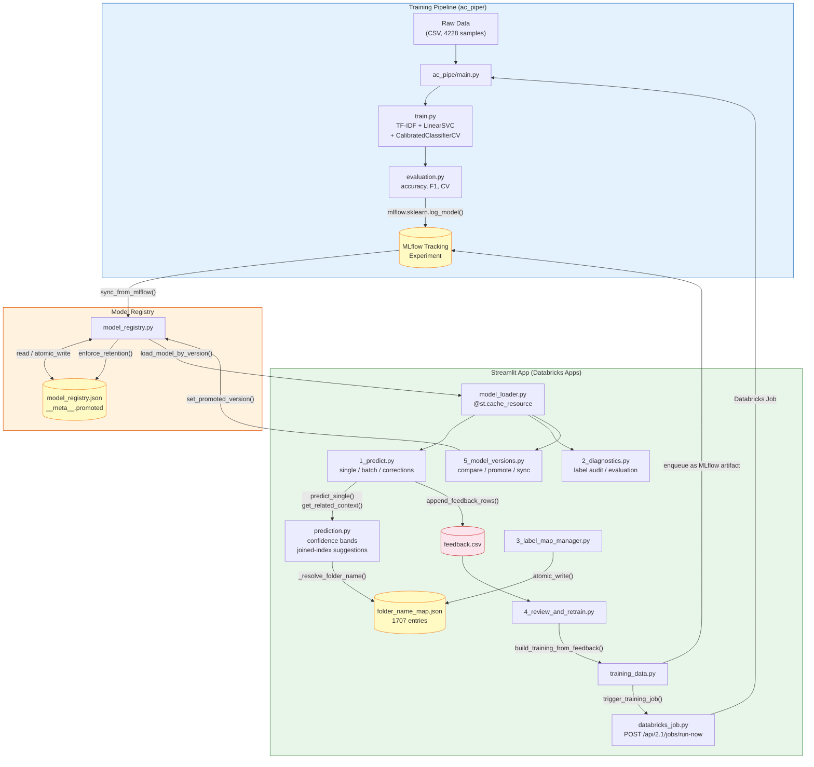
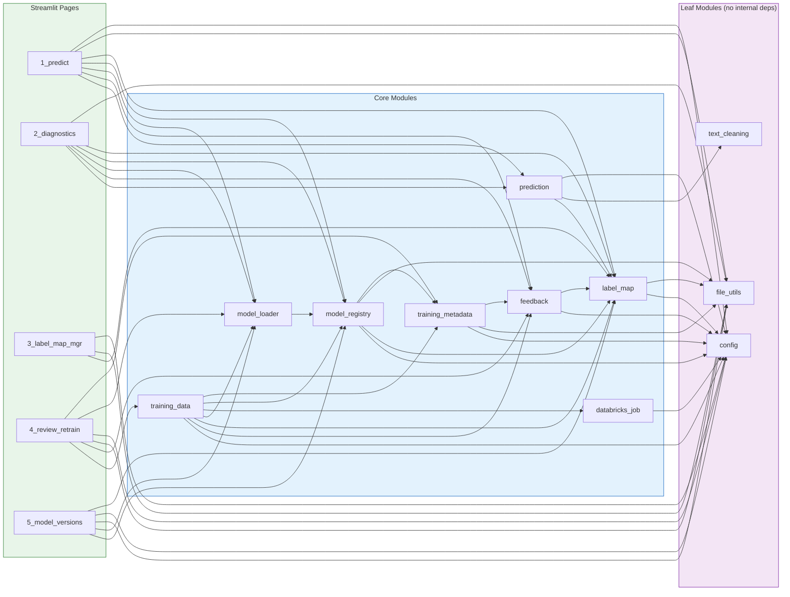
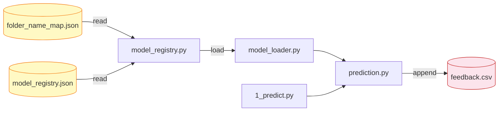
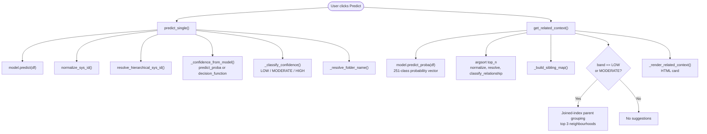
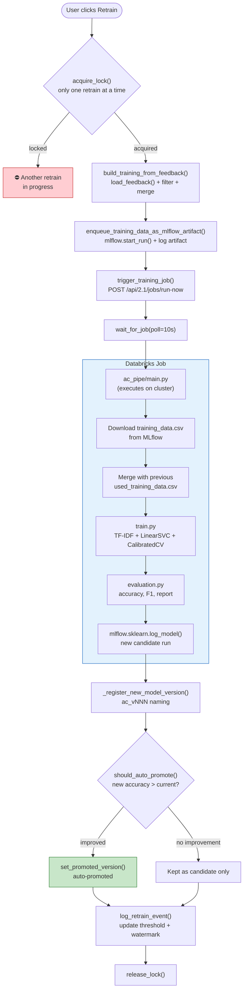
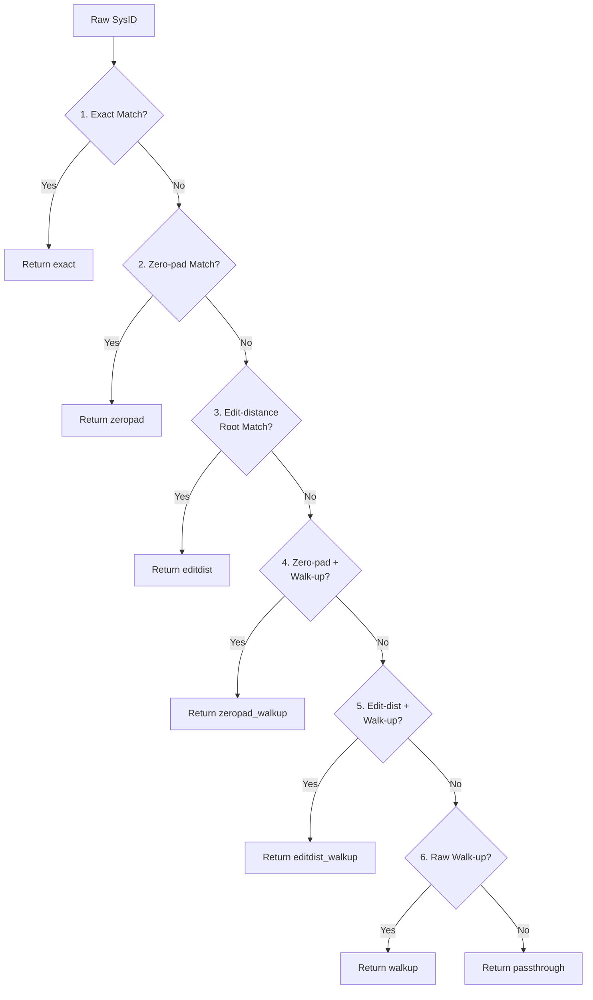

# Corporate Archives — System Architecture & Debugging Reference

> **Purpose:** Single-source reference for tracing errors, understanding data flows,
> and debugging the Auto-Classification system. Open this when something breaks.
>
> **Generated from:** codebase scan of `src/` (13 core modules + 1 shim, 5 pages) and `ac_pipe/` (4 modules).
>
> **Last updated:** 24 March 2026 — v1.2 (training metadata, auto-retrain, model naming).
>
> **Machine-readable graph:** [`dependency-graph.json`](dependency-graph.json)

---

## 1. System Lifecycle



---

## 2. Module Dependency Graph



---

## 3. File Artifact Matrix

Every persistent file the system reads or writes, and which modules touch it.

| Artifact | Path (relative to `src/`) | Read By | Written By | Format |
|---|---|---|---|---|
| **model_registry.json** | `artifacts/` | model_registry, model_loader, 5_model_versions | model_registry (`atomic_write`) | JSON |
| **feedback.csv** | `artifacts/` | feedback, training_data, 4_review_retrain, 2_diagnostics | feedback (`append_feedback_rows`) | CSV |
| **training_data.csv** | `artifacts/` | training_data, 4_review_retrain | training_data (`build_training_from_feedback`) | CSV |
| **folder_name_map.json** | `artifacts/` | model_registry, label_map, 3_label_map_mgr, prediction (via load) | 3_label_map_mgr (`atomic_write`) | JSON |
| **label_map.json** | `artifacts/` | label_map, 3_label_map_mgr | label_map (`atomic_write`) | JSON |
| **folder_mapping.csv** | `artifacts/` | model_registry (fallback), 3_label_map_mgr | 3_label_map_mgr | CSV |
| **taxonomy_audit_log.csv** | `artifacts/` | 3_label_map_mgr | 3_label_map_mgr | CSV |
| **training_metadata.json** | `artifacts/` | training_metadata, training_data, 4_review_retrain | training_metadata (`atomic_write`) | JSON |
| **MLflow model artifact** | `runs:/<run_id>/model` | model_registry (`mlflow.sklearn.load_model`) | ac_pipe/train.py (`mlflow.sklearn.log_model`) | MLflow |
| **MLflow experiment** | Databricks tracking server | 5_model_versions, 2_diagnostics | ac_pipe/evaluation.py | MLflow |

### Critical File Path



If `folder_name_map.json` is missing: predictions work but names fall back to raw SysIDs.\
If `model_registry.json` is missing or corrupt: **app cannot load any model**.

---

## 4. CONFIG Reference

All keys in the `CONFIG` dict (`core/config.py`), what they control, and what breaks if wrong.

| Key | Source | Default | Used By | Failure Mode |
|---|---|---|---|---|
| `app_root` | Computed | `src/` parent | Everything | All paths break |
| `artifacts_dir` | Computed | `{app_root}/artifacts` | feedback, label_map, 3_label_map_mgr | FileNotFoundError on reads |
| `folder_name_map` | Computed | `artifacts/folder_name_map.json` | model_registry, 3_label_map_mgr | Names show as raw SysIDs |
| `folder_mapping_csv` | Computed | `artifacts/folder_mapping.csv` | model_registry (fallback) | Falls back to map keys |
| `label_map_json` | Computed | `artifacts/label_map.json` | label_map, 3_label_map_mgr | Label resolution fails |
| `feedback_csv` | Computed | `artifacts/feedback.csv` | feedback, training_data | No retraining data |
| `training_data_csv` | Computed | `artifacts/training_data.csv` | training_data, 4_review_retrain | Retraining fails |
| `model_registry_json` | Computed | `artifacts/model_registry.json` | model_registry | **App cannot start** |
| `databricks_host` | Env/Secrets | `None` | databricks_job | Retrain job trigger fails |
| `databricks_token` | Env/Secrets | `None` | databricks_job | Retrain job trigger fails |
| `training_job_id` | Env/Secrets | `None` | databricks_job | Retrain job trigger fails |
| `mlflow_experiment` | Env/Secrets | `/Users/.../ac_model` | training_data, sync | Model discovery fails |
| `mlflow_tracking_uri` | Env/Secrets | `databricks` | main.py | MLflow operations fail |
| `confidence_bands` | Hardcoded | `{low_upper: 0.23, high_lower: 0.92}` | prediction, 1_predict | Bands shift; no crash |
| `retention_max_versions` | Hardcoded | `3` | model_registry | More/fewer versions kept |
| `training_metadata_json` | Computed | `artifacts/training_metadata.json` | training_metadata | Metadata tracking fails; auto-retrain disabled |
| `retrain_settings` | Hardcoded | `{base: 200, min: 50, max: 1000, growth: 0.1}` | training_metadata | Threshold defaults used |

---

## 5. Page-to-Backend Call Chains

For each user action, the exact sequence of function calls.

### 5.1 Single Prediction (1_predict.py)



### 5.2 Correction Submission

```
User selects correction + clicks "Submit"
  |
  +-> normalize_sys_id(corr_val)
  +-> resolve_hierarchical_sys_id(corr, trained_labels)
  +-> append_feedback_rows([{Title, Description, Predicted, Correct, ...}])
        +-> _feedback_path()              -> CONFIG["feedback_csv"]
        +-> load existing feedback.csv
        +-> deduplicate (hash: title+desc+correct)
        +-> skip if: duplicate / blank correct / pred == correct
        +-> atomic append to CSV
```

### 5.3 Retraining Flow



### 5.4 Model Promotion

```
User clicks "Promote" (5_model_versions.py)
  |
  +-> set_promoted_version(new_version)
  |     +-> current promoted -> __meta__.previous_promoted
  |     +-> __meta__.promoted = new_version
  |     +-> save_model_registry()
  |
  +-> clear_model_caches()                -> force reload
  +-> enforce_retention(max_versions=3)
        +-> keep: promoted + previous + most_recent
        +-> archive older from JSON (MLflow artifacts untouched)
```

### 5.5 MLflow Sync

```
sync_from_mlflow()  (5_model_versions or on load error)
  |
  +-> search_runs(filter="candidate::*", status=FINISHED)
  +-> purge entries whose MLflow run was deleted
  +-> register new entries in model_registry.json
  +-> save_model_registry()
  +-> enforce_retention()
```

---

## 6. Error Propagation Paths

### 6.1 "Model not found" / App fails to start

```
Root causes:
  - model_registry.json missing or corrupt
  - MLflow run deleted (stale URI in registry)
  - sync_from_mlflow() hasn't been called
  - retention policy archived the version

Fix: Check artifacts/model_registry.json. Run sync from 5_model_versions.
```

### 6.2 Predictions show raw SysIDs instead of folder names

```
Root causes:
  - folder_name_map.json is missing the entry
  - SysID not normalised (case/slash mismatch)
  - folder_name_map loaded from wrong path

Fix: Check CONFIG["folder_name_map"] path. Use 3_label_map_manager to add entries.
```

### 6.3 Neighbourhood suggestions not appearing

```
Root causes:
  - Confidence is genuinely HIGH (correct behaviour)
  - Threshold preset is "Permissive" (bands too narrow)
  - CONFIG["confidence_bands"] overridden incorrectly

Fix: Check sidebar preset. Try "Conservative". Use Developer Tools debugger.
```

### 6.4 Feedback not saving / corrections lost

```
Root causes:
  - Duplicate (same title+desc+correct already in feedback.csv)
  - Blank correct SysID
  - Predicted == Correct (skipped by design)
  - Permission error on artifacts/ directory

Fix: Check return summary for skip counts. Inspect feedback.csv.
```

### 6.5 Retraining job fails to trigger

```
Root causes:
  - DATABRICKS_HOST not set in env/secrets
  - DATABRICKS_TOKEN expired
  - TRAINING_JOB_ID wrong
  - Network: can't reach Databricks API

Fix: Check .env or Streamlit secrets for all three keys.
```

### 6.6 Retrain lock contention / stale lock

```
Root causes:
  - Another retrain is genuinely running (wait for it)
  - Previous retrain crashed without releasing lock
  - Lock is stale (older than 2 hours — auto-released)

Fix: Check training_metadata.json "lock" field. Stale locks auto-clear
after 2h. Manually set "lock": null to force-release.
```

### 6.7 "No module training" on model load

```
Root causes:
  - src/training/train.py missing (deserialization shim)
  - _select_text function not importable at training.train._select_text

Fix: Ensure src/training/__init__.py and src/training/train.py exist.
train.py only needs the _select_text() function.
```

### 6.8 Batch predictions produce empty results

```
Root causes:
  - All rows failed is_rubbish() check
  - Column mapping wrong (title_col / desc_col)
  - All rows NaN in both columns
  - File encoding issue

Fix: Check File Preview section. Try single prediction with pasted text.
```

---

## 7. Quick Diagnostic Checklist

| # | Check | Location |
|---|---|---|
| 1 | App logs | Databricks Apps > deployment logs |
| 2 | model_registry.json exists | `artifacts/` — has `__meta__.promoted`? |
| 3 | folder_name_map.json | `artifacts/` — 1707 entries expected |
| 4 | feedback.csv | `artifacts/` — not corrupt, has header? |
| 5 | MLflow experiment | Experiments UI > `ac_model` — runs exist? |
| 6 | Env/Secrets set | `DATABRICKS_HOST`, `TOKEN`, `JOB_ID`, `EXPERIMENT` |
| 7 | Model loads | 5_model_versions > Sync > model listed? |
| 8 | Confidence bands | Sidebar > preset + caption visible? |
| 9 | training_metadata.json | `artifacts/` — lock is null? threshold reasonable? |
| 10 | Model naming | Versions use `ac_vNNN` format? |

---

## 8. Module Quick Reference

| Module | Lines | Responsibility | Key Functions |
|---|---|---|---|
| `config.py` | 67 | Path resolution, env/secret loading | `CONFIG` dict |
| `prediction.py` | 422 | Classify, confidence, related context | `predict_single`, `predict_batch_df`, `get_related_context` |
| `model_registry.py` | 432 | JSON registry CRUD, MLflow sync, retention | `sync_from_mlflow`, `enforce_retention`, `set_promoted_version` |
| `model_loader.py` | 55 | Cached model loading via Streamlit | `load_model_for_version`, `clear_model_caches` |
| `feedback.py` | 210 | Feedback CSV CRUD with dedup | `append_feedback_rows`, `load_feedback`, `deduplicate_feedback` |
| `label_map.py` | 175 | SysID normalisation, hierarchical resolution | `normalize_sys_id`, `resolve_hierarchical_sys_id` |
| `training_data.py` | 428 | Training data build, MLflow enqueue, job trigger, auto-promote | `build_training_from_feedback`, `run_retraining_mlflow_via_job` |
| `training_metadata.py` | 372 | Retrain tracking, locking, thresholds, naming, auto-promote logic | `get_retrain_status`, `next_version_name`, `acquire_lock`, `log_retrain_event`, `should_auto_promote` |
| `text_cleaning.py` | 30 | Text normalisation, rubbish detection | `clean_text`, `is_rubbish` |
| `file_utils.py` | 60 | Atomic JSON write, CSV helpers | `atomic_write`, `load_csv_or_excel` |
| `pipeline_utils.py` | 6 | Deserialization shim for pickled models | `select_text_column` |
| `training/train.py` | 12 | Deserialization shim for `_select_text` in pickled models | `_select_text` |
| `databricks_job.py` | 100 | Databricks Jobs API wrapper | `trigger_training_job`, `wait_for_job` |

---

## 9. Data Format Contracts

### feedback.csv
```
Title,Description,Predicted SysID,Correct SysID,Model Version,Timestamp
"doc title","doc desc","LT000266/004/003","LT000266/004/005","tfidf_svm_v...","2026-03-17T14:35:00"
```

### folder_name_map.json
```json
{
  "LT000266": "London Transport Museum",
  "LT000266/004": "Photographs Collection",
  "LT000266/004/003": "Station Photography"
}
```

---

### training_metadata.json
```json
{
  "retrains": [
    {
      "retrain_id": 1, "version": "ac_v001", "timestamp": "...",
      "dataset_size": 4228, "new_corrections": 200,
      "accuracy": 0.823, "f1_macro": 0.78, "promoted": true,
      "threshold_used": 200, "training_run_id": "...", "notes": "..."
    }
  ],
  "current_threshold": 207,
  "corrections_at_last_retrain": 200,
  "lock": null,
  "next_version_number": 2,
  "settings": {
    "base_threshold": 200, "min_threshold": 50,
    "max_threshold": 1000, "growth_factor": 0.1, "stale_lock_hours": 2
  }
}
```

### model_registry.json (updated — ac_vNNN naming)
```json
{
  "__meta__": {
    "promoted": "ac_v001",
    "previous_promoted": null
  },
  "ac_v001": {
    "mlflow_model_uri": "runs:/<run_id>/model",
    "trained_on": "20260317_143022",
    "model_type": "tfidf_svm",
    "accuracy": 0.823,
    "f1_macro": 0.78,
    "n_training_samples": 4228,
    "notes": "Cumulative retrain from feedback",
    "pipeline_version": "v3.1",
    "folder_name_map": "artifacts/folder_name_map.json"
  }
}
```

---

## 10. Environment Variables / Secrets

| Variable | Required For | Where Set |
|---|---|---|
| `DATABRICKS_HOST` | Retraining job trigger | `.env` or Streamlit secrets |
| `DATABRICKS_TOKEN` | Retraining job trigger | `.env` or Streamlit secrets |
| `TRAINING_JOB_ID` | Retraining job trigger | `.env` or Streamlit secrets |
| `MLFLOW_EXPERIMENT` | Model discovery, sync | `.env` or Streamlit secrets |
| `MLFLOW_TRACKING_URI` | MLflow operations | `.env` (default: `databricks`) |


## 11. Label Normalisation (v3.0)

### Problem
Zero-padding inconsistencies in training data create false singleton classes:
- **File-level indexes**: `LT000266/001/025/002/001` → separate class, but parent `LT000266/001/025/002` exists
- **Root prefix short**: `LT0258` should be `LT000258`
- **Root digits misplaced**: `LT00032` should be `LT000320`
- **Segment padding short**: `/01/` should be `/001/`

### Resolution Chain (priority order — specificity-first)



**Key design decision**: Walk-up runs LAST because it is lossy (drops segments).
Zero-pad and edit-distance corrections preserve the full path depth.

### Where Normalisation Runs

| Module | Function | When |
|---|---|---|
| `core/prediction.py` | `get_related_context()`, `predict_single()`, `predict_batch_df()` | After model.predict(), before returning to UI |
| `core/feedback.py` | `append_feedback_rows()` | After validation, before dedup/write |
| `core/training_data.py` | `build_training_from_feedback()` | After label resolution, before writing CSV |
| `ac_pipe/main.py` | `build_train_test()` | After cumulative merge, before train/test split |

### Implementation

- **Module**: `core/label_map.py` — `TaxonomyIndex` class, `normalise_to_taxonomy()`, `normalise_to_taxonomy_verbose()`
- **Index**: Pre-built canonical index (`alpha:int` form), root segment index for edit-distance search
- **Helpers**: `_parse_segment()`, `_canonicalize_segments()`, `_edit_distance()` (Levenshtein)
- **Experiment**: `ac_model_v2` — all new models log normalisation metrics (`classes_before_norm`, `classes_after_norm`)

### Taxonomy Manager: Typo Detection (page 3)

Five-tab interface added to `pages/3_label_map_manager.py`:

1. **Live Resolver** — Type a SysID, see instant resolution with method badge, folder name, siblings, canonical form details
2. **Batch Resolver** — Paste multiple SysIDs or upload CSV, get full resolution table with downloadable report
3. **Data Audit** — Scans `training_data.csv`, `feedback.csv`, and MLflow `used_training_data` for non-exact matches. Shows class-count impact analysis
4. **Resolution Stats** — Distribution of methods, exact match rate, collections with most issues
5. **Knowledge Base Search** — Reverse lookup by folder name using 4 strategies: substring, fuzzy (difflib), token overlap, hierarchical path search
